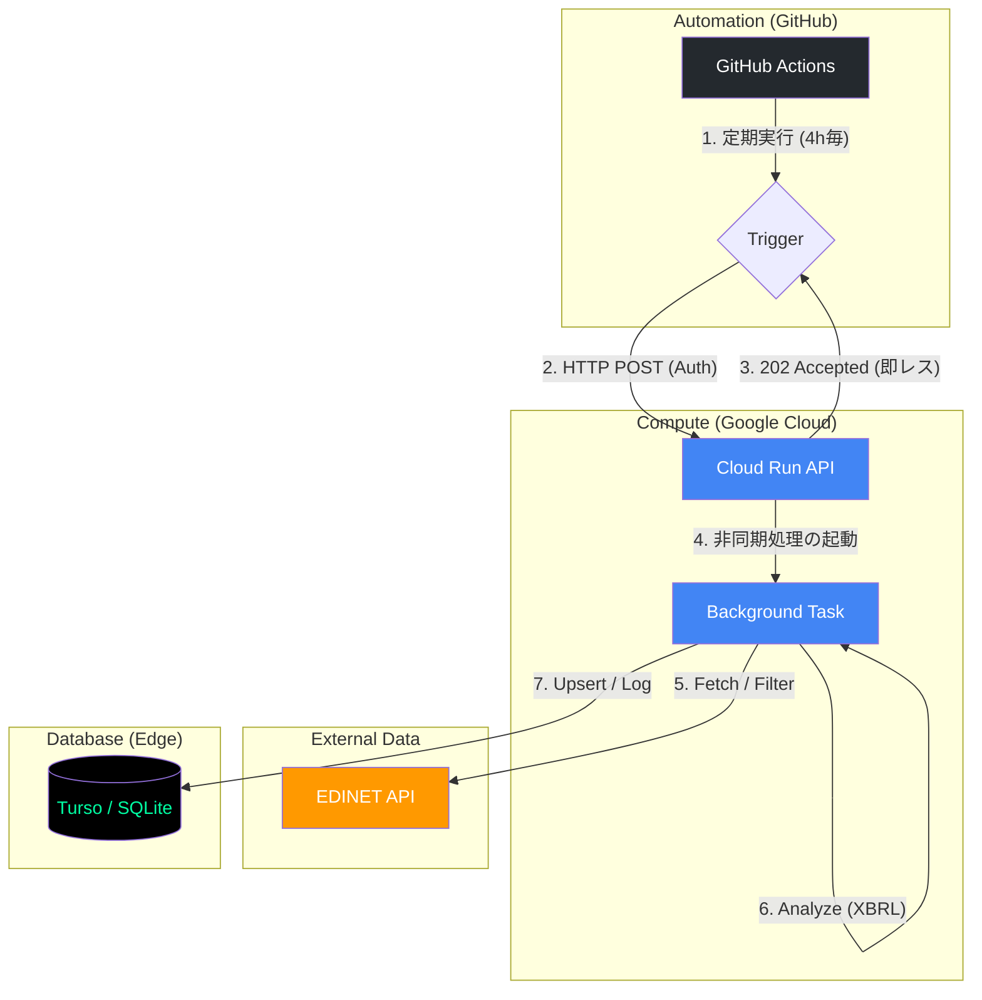

なるほど、整理できました。Cloud Run **Jobs** ではなく、常時起動（またはリクエスト時起動）している **Cloud Run サービス（Web API）** のエンドポイントを GitHub Actions から叩く構成ですね。

この場合、GitHub Actions は単なる `curl` や `http` リクエストの送信役になります。

---

## 🏗️ 全体構造


### 処理のシーケンス
1.  **GitHub Actions:** `POST https://[Cloud-Run-URL]/import` を叩く。
2.  **Cloud Run (API層):** リクエストを受け取り、**即座に** `{"status": "accepted"}` をレスポンス（ここでGitHub Actionsは終了）。
3.  **Cloud Run (バックグラウンド層):** レスポンスを返した後に、実際の「EDINET取得〜Turso保存」の重たい処理を実行する。

---

## 🛠️ GitHub Actions 側の実装案

もっともシンプルに `curl` で実行します。認証が必要な場合（推奨）は Google Cloud の IDトークンを付与します。

```yaml
name: Trigger Import API

on:
  schedule:
    - cron: '0 */4 * * *'
  workflow_dispatch:

jobs:
  trigger:
    runs-on: ubuntu-latest
    permissions:
      id-token: 'write'
    steps:
      - id: 'auth'
        uses: 'google-github-actions/auth@v2'
        with:
          credentials_json: '${{ secrets.GCP_SA_KEY }}'

      - name: 'Call Cloud Run API'
        run: |
          # IDトークンを取得してCloud Runを叩く
          TOKEN=$(gcloud auth print-identity-token)
          curl -X POST https://your-cloud-run-url.a.run.app/import \
            -H "Authorization: Bearer $TOKEN" \
            -H "Content-Type: application/json"
```

---

## ⚠️ 実装上の最重要ポイント：非同期処理

Cloud Run (API) 側で普通に処理を書くと、処理が終わるまでレスポンスを返せません。これだと GitHub Actions が長時間待機することになり、タイムアウトや通信断のリスクが生じます。

**「リクエストを受け取ったら、処理の完了を待たずにすぐレスポンスを返す」** 実装が必要です。

### Python (FastAPI) での実装例
`BackgroundTasks` を使うのが最も手軽です。

```python
from fastapi import FastAPI, BackgroundTasks, Response

app = FastAPI()

def long_running_import():
    # ここに「インポートの流れ」を書く
    # Fetch List -> Filter -> Analyze -> Transaction
    print("Starting heavy import process...")
    # ...

@post("/import")
async def trigger_import(background_tasks: BackgroundTasks):
    # 重い処理をバックグラウンドに放り込む
    background_tasks.add_task(long_running_import)
    
    # 処理の開始だけ伝えて、即座に202 Acceptedを返す
    return {"message": "Import process started in background."}
```

---

## ⚖️ この構成のメリットと懸念点

### メリット
* **疎結合:** GitHub Actions 側は「URLを叩くだけ」なので非常にシンプル。
* **低コスト:** GitHub Actions の実行時間は 1〜2秒で済む。

### 懸念点（注意が必要なこと）
* **Cloud Run のタイムアウト:** Cloud Run（サービス）はデフォルトで 5分（最大60分）のリクエストタイムアウトがあります。バックグラウンド処理がこれを上回る可能性がある場合は、前回の Cloud Run **Jobs** の方が適しています。
* **二重実行の制御:** 4時間に1回なのであまり起きませんが、処理が長引いて次の実行が重なった場合、Tursoへの書き込みが競合しないよう、DBレベルでのロックや「実行中フラグ」の管理が必要です。

---

はい、Mermaid形式でシステム構成図を作成します。
GitHub Actionsが「着火（Trigger）」、Cloud Runが「脳（Logic）」、Tursoが「記憶（Storage）」、そしてEDINETが「ソース」という役割分担が視覚的にわかりやすくなるよう整理しました。



### 図のポイント解説

1.  **GitHub Actions の役割**: 
    * 自身で重い処理はせず、認証情報（IDトークン）を持ってCloud Runを叩くだけに徹します。これにより「タイムアウト」の制約を回避します。
2.  **Cloud Run の「即レス」**:
    * APIエンドポイントがリクエストを受けると、中の処理（Background Task）を切り離して起動し、GitHubには「受け付けました」とすぐに返します。
3.  **データフロー**:
    * Cloud Runのバックグラウンド処理が、EDINETへの問い合わせとXBRL解析を行い、最終的な成果物と実行ログをTursoへ保存します。

---

### 追加のTips
この構成を維持する場合、Cloud Runの**「CPUの割り当て」**設定に注意してください。

* **「リクエストの処理中のみ CPU を割り当てる」** 設定にしていると、レスポンスを返した瞬間にCPUパワーが極端に絞られ、バックグラウンド処理が異常に遅くなる（または停止する）ことがあります。
* **対策**: `Cloud Run` の設定で **「CPU を常に割り当てる（CPU always allocated）」** を選択するか、あるいは処理が終わるまでレスポンスを待機させる（この場合はGitHub Actionsのタイムアウトを伸ばす）構成を検討してください。

もし「CPU always allocated」によるコスト増を避けたい場合は、前述した **Cloud Run Jobs**（HTTPレスポンスを介さないジョブ実行形式）の方が、今回のようなバッチ処理には向いているかもしれません。

今のところ、この「API呼び出し + バックグラウンド処理」の形で実装を進める方針でよろしいでしょうか？

